# Product REST API – Spring Boot Project

This project was created as part of **Task 2** for the course *Java and Spring Framework Applications* at **Vistula University**.  
The main goal of this project is to gain practical experience in building a RESTful application using Spring Boot and to understand how different layers of a backend system work together in a real project.

The application provides functionality for managing products and allows users to perform basic CRUD operations (Create, Read, Update, Delete).  
At the same time, the project focuses not only on functionality but also on clean architecture, good coding practices and proper use of modern Spring technologies.

---

## Technologies used

During the development of this project, the following tools and technologies were applied:

- Java 17
- Maven
- Spring Boot
- Spring Web
- Spring Data JPA
- Hibernate
- H2 in-memory database
- Swagger / OpenAPI
- Postman
- IntelliJ IDEA

These technologies make it possible to build a modern backend application that is easy to maintain, test and extend.

---

## Application structure

The project follows a layered architecture that reflects common practices used in professional backend development.  
Each layer has a clearly defined responsibility, which makes the codebase easier to understand and maintain.

The main layers of the application are:

- **Domain layer** – contains the `Product` entity, which represents data stored in the database.
- **Repository layer** – responsible for communication with the database using Spring Data JPA.
- **Service layer** – contains business logic and coordinates data flow between repository and controller.
- **Controller layer** – exposes REST endpoints for client interaction.
- **DTO layer** – request and response objects used for data transfer.
- **Exception handling layer** – centralized error handling using `@ControllerAdvice`.

---

## Database configuration

For development and testing purposes, the project uses the **H2 in-memory database**.  
This solution allows fast testing without the need to install an external database server.

Main configuration features:

- Database is stored only in memory during application runtime.
- H2 Console is enabled for easy inspection of data.
- Hibernate automatically creates database tables based on JPA entities.

H2 Console is available at:  
`http://localhost:8080/console`

Connection settings:
- JDBC URL: `jdbc:h2:mem:testdb`
- Username: `sa`
- Password: *(empty)*

---

## Swagger / OpenAPI

The project uses **Springdoc OpenAPI** to automatically generate API documentation.  
Thanks to Swagger UI, all endpoints can be tested directly from the browser.

Swagger UI is available at:  
`http://localhost:8080/swagger-ui/index.html`

---

## API usage and screenshots

Below are examples of using the API.  
Each step is illustrated with screenshots taken from Postman and Swagger UI.

### 1. Creating the first product (POST)
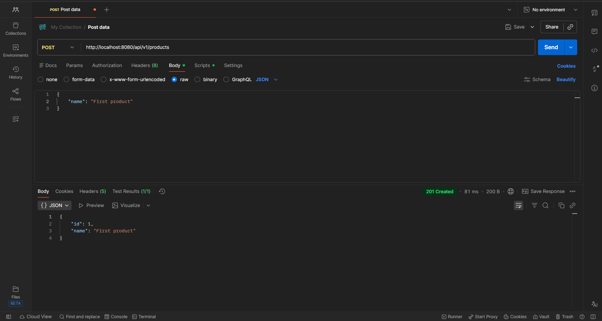

---

### 2. Swagger UI overview
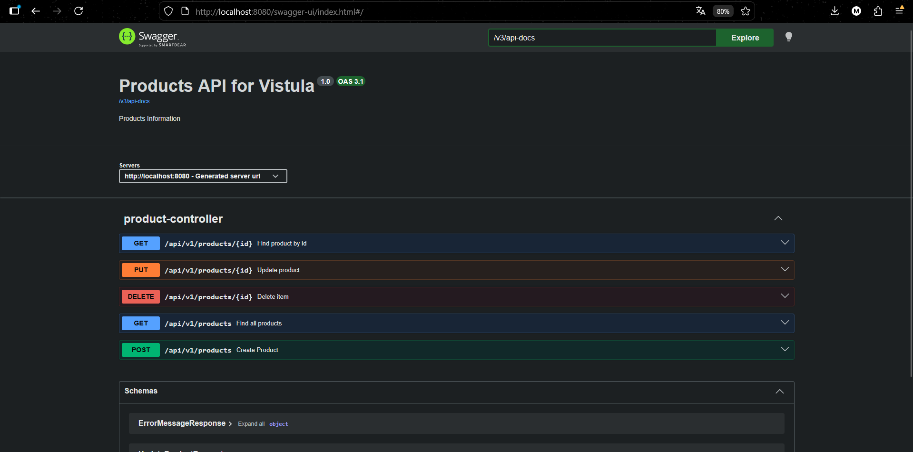

---

### 3. Getting the first product (GET by ID)
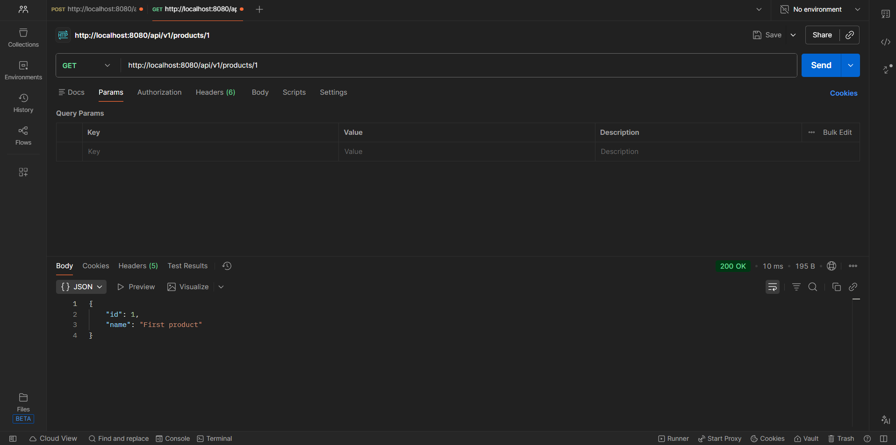

---

### 4. Handling Product Not Found exception
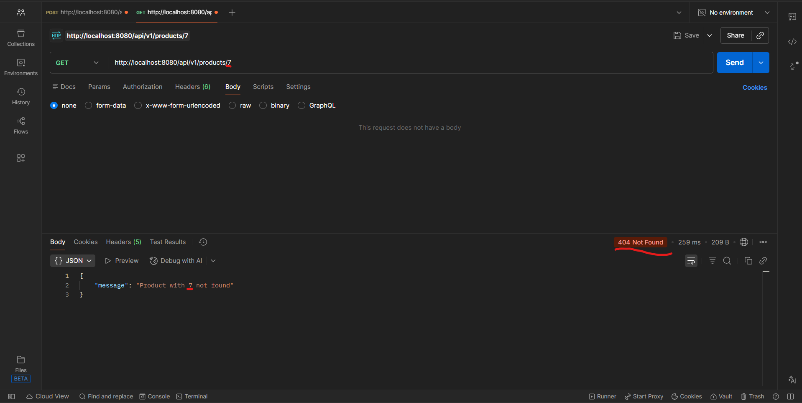

---

### 5. Creating the second product (POST)
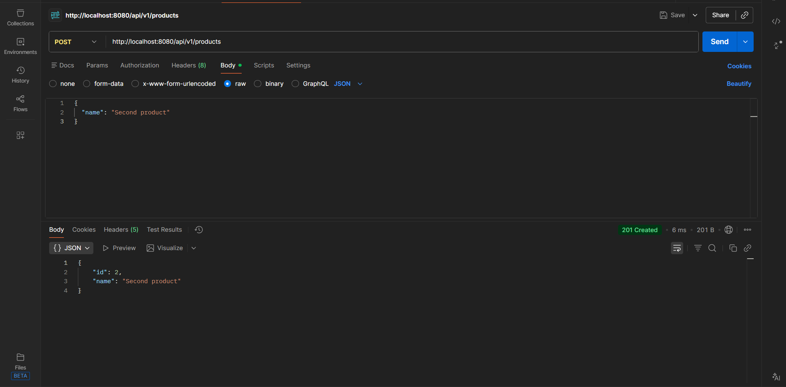

---

### 6. Updating the second product (PUT)
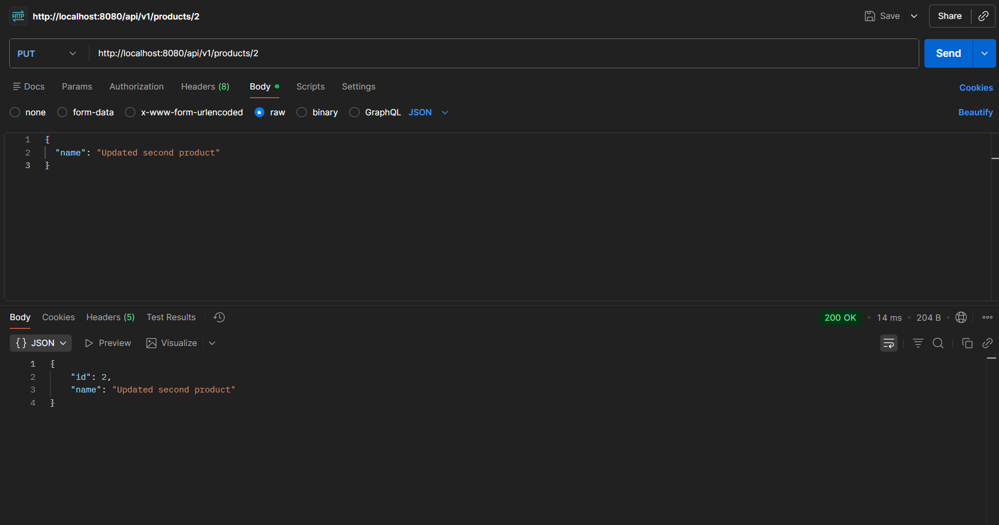

---

### 7. Getting updated second product
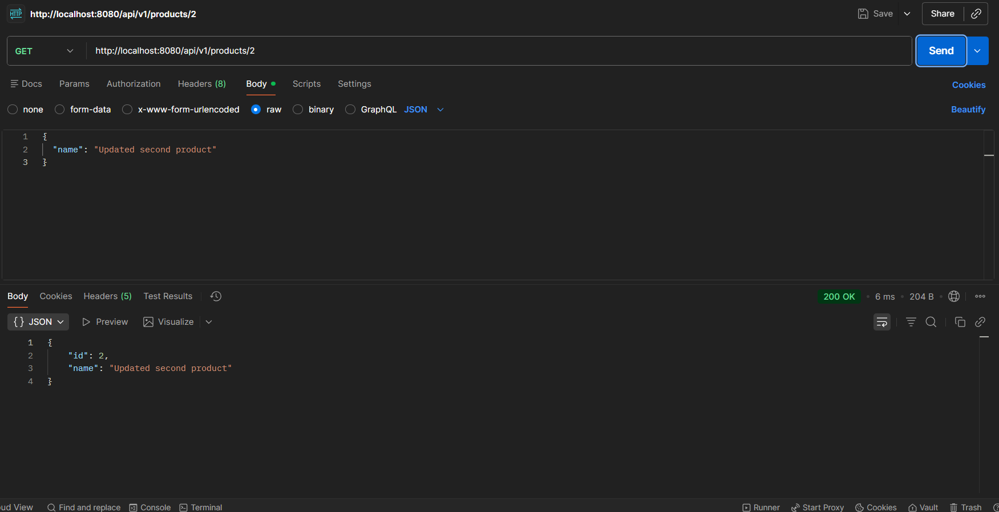

---

### 8. Handling Not Found exception when updating non-existing product
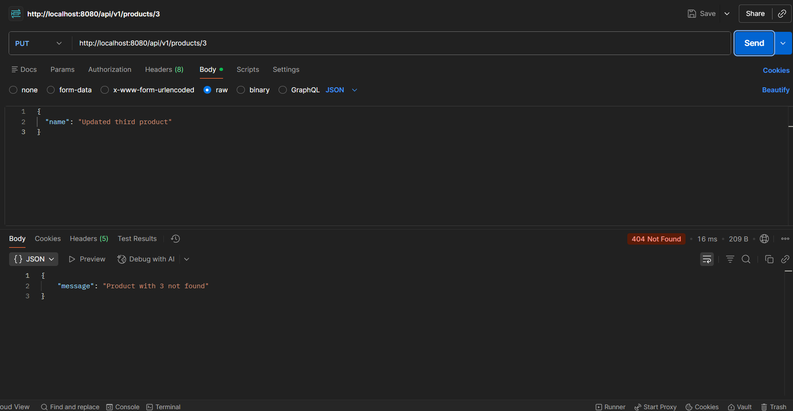

---

### 9. Getting all products (GET ALL)
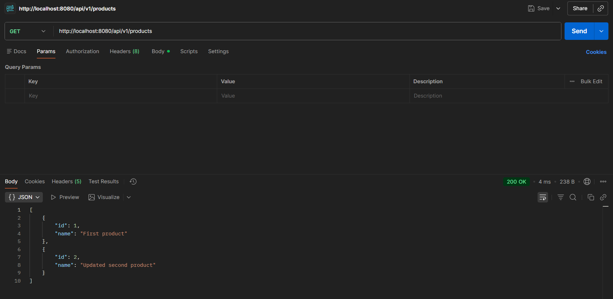

---

### 10. Deleting the first product
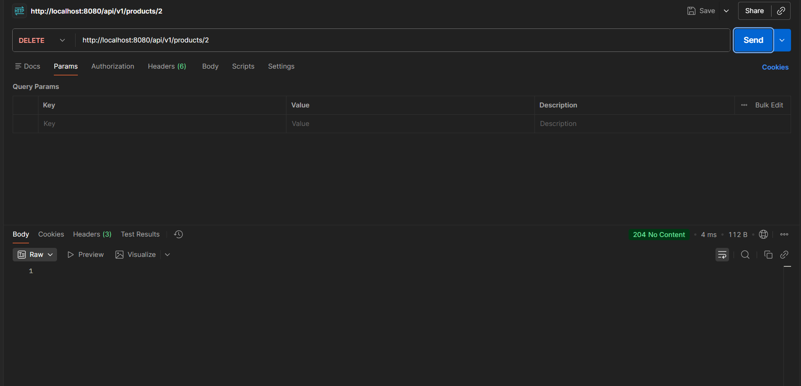

---

### 11. Getting all products after deleting the first one
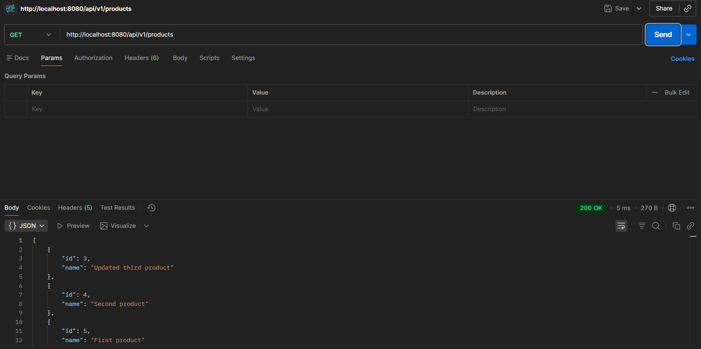

---

### 12. Trying to delete a non-existing product
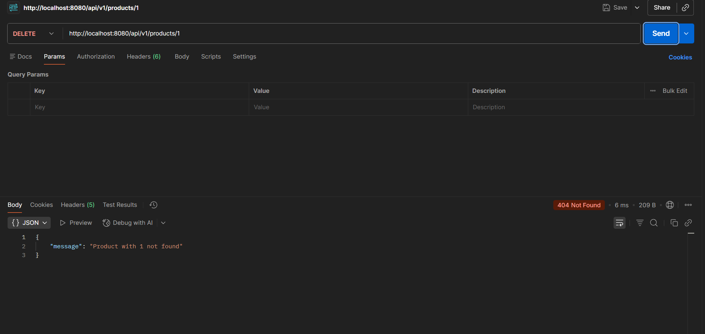

---

### 13. Inserting values directly into database table (H2 Console)
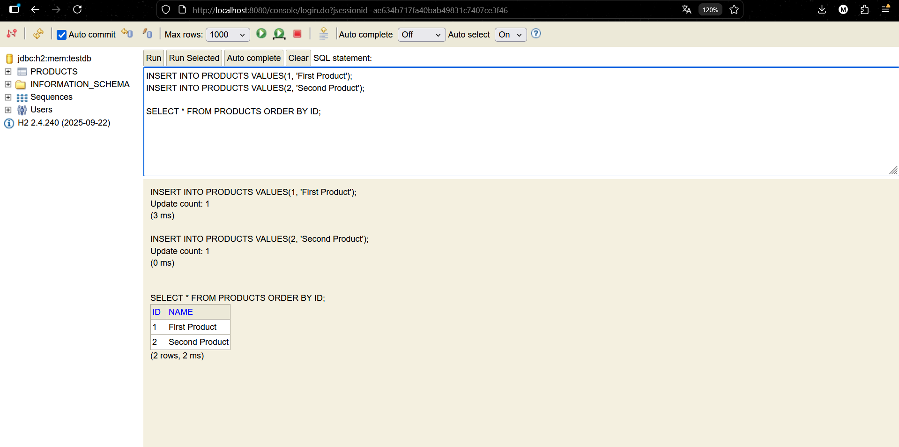

---

### 14. Updating the first product
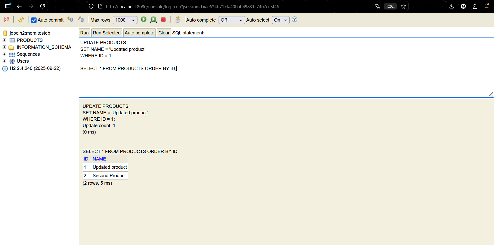

---

### 15. Deleting the first product (final state)
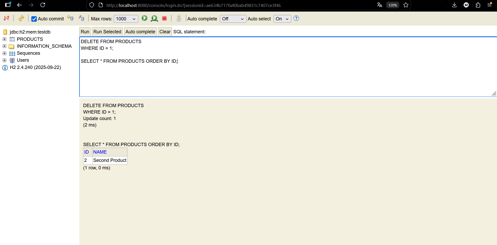

---

## Explanation of Spring Data JPA repository behavior

One of the questions in this project concerns the following situation:

> How is it possible that the `ProductService` class uses methods such as `save()`, `findById()`, `findAll()` and `deleteById()`, even though these methods are not implemented in the `ProductRepository` interface?

The answer is related to the way **Spring Data JPA** works.

`ProductRepository` extends the `JpaRepository<Product, Long>` interface.  
`JpaRepository` already contains ready-to-use implementations of common CRUD operations.  
At runtime, Spring automatically creates a proxy class that implements these methods for us.

This means that:

- We do not need to manually implement basic database operations.
- Spring generates the required logic based on the repository interface definition.
- Thanks to this mechanism, development becomes faster and the code stays clean and simple.

This feature is one of the most important advantages of using Spring Data JPA.

---

## Conclusion

This project allowed me to gain practical experience in building a RESTful backend application using Spring Boot and modern Java technologies.  
During development, I learned how to design a layered architecture, configure a database, handle exceptions in a centralized way and document APIs using Swagger.

The project also helped me better understand how frameworks like Spring simplify development by providing ready-to-use solutions, such as automatic repository implementations in Spring Data JPA.

Overall, this assignment was a valuable step in developing my skills in backend application development.

--- 

## Author
Maksym Odazhiu  
Vistula University - Computer Engineering.
